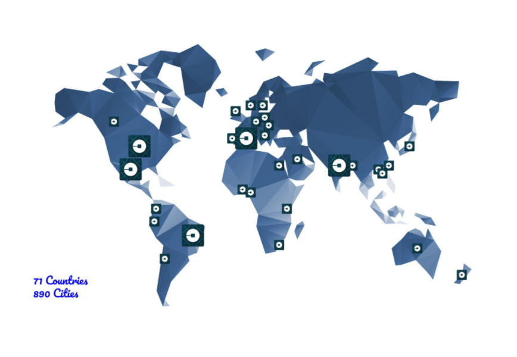
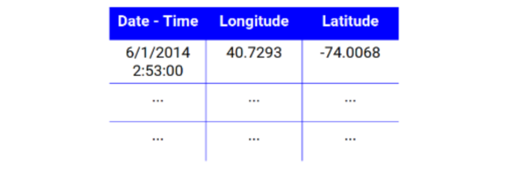
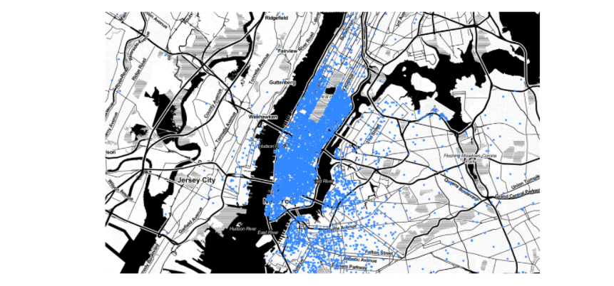
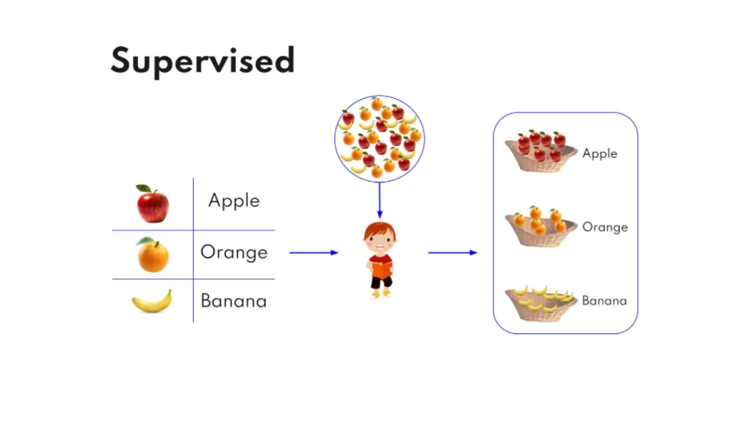
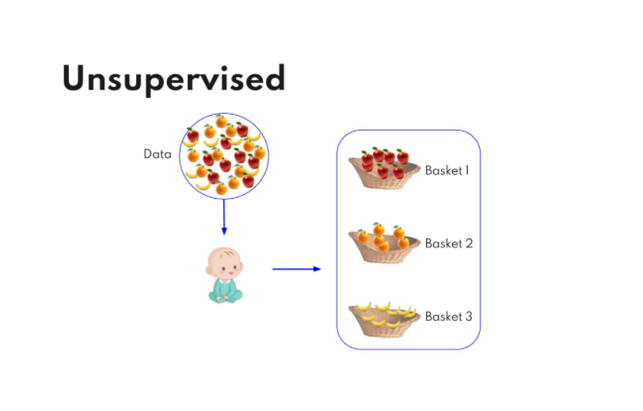

# The-Uber-way
Unsupervised Machine Learning

# About

---

Uber Technologies, Inc., commonly known as Uber, is an American technology company. Its services include ride-hailing, food delivery (Uber Eats), package delivery, couriers, freight transportation. Formerly it was known as Ubercab (2009-2011). Uber’s net worth is $75 million. Currently Uber is present in 71 countries and 890 cities, with 5 major countries; US, Mexico, Brazil, Spain, and India.

If you might have ever booked an Uber cab, you must have noticed that the process is quite simple –just press a button, set the pickup location, request a car, go for a ride and pay with a click of a button. The process is simple but there is a lot going on behind the scenes.

As it turns out, there’s a great deal of data being collected, produced, and visualized behind the scenes — all working to create a more efficient company and impact transportation as a whole.

we are going to learn how Uber saves your time in reaching your destination.

# How Uber determines Optimal Position of Cabs

---

# #1 Data Collection

---

Every time someone books a ride from Uber's application, Uber saves their location with a timestamp. Uber has been collecting this data since they begin its operations. Uber uses this data to determine the optimal position of cabs.

We can also plot these coordinated in a map by importing folium module

# #2.1 Supervised Learning

---

As the name suggests, this type of learning algorithm has a supervisor or teacher. Basically, a well labeled data is the supervisor or teacher, and the algorithm uses this data to learn patterns or features. Like in the fruit sorting problem, a child who can read was given a table of fruits and their names. He was later asked to sort the fruits in a basket. With the provided table, he was able to sort them and knows which basket contains which fruit.

# #2.2 Unsupervised Learning

---

Unlike supervised learning, there are no supervisor or teacher present i.e. algorithms use unlabelled data to find features or patterns. Consider a newborn child who can’t read. We cannot give the same table that we gave to the previous child. But when this child will be asked to sort the fruits, he/she can sort on the basis of shape, color, or weight. One thing to notice is that at the end, he was able to sort the fruits in a basket but he/she still doesn’t know which basket contains which fruit.

# #3 K Means

---

K Means is an Unsupervised clustering algorithm used to find clusters in unlabelled data. This algorithm is used to divide data into K clusters, where K is a variable that depends on the case (a problem that we are solving) and efficiency. This algorithm takes data as input and returns centroids of K clusters.

# #3.1 Centroid Initialization

---

It marks the beginning of the algorithm, and the K number of centroids is randomly initialized. There are two ways they can be initialized.

Assigning random K data points from the dataset as centroids.

Assigning random K points (not from the dataset) as centroids.

# #3.2 Clustering

---

In this step, the algorithm enters the loop and computes the distance between each data point and each centroid. Data points are assigned to cluster centroid which is closest. After this step, we have K clusters of data points.

# #3.2 Updating centroids

---

In this step, centroids are calculated using data points of the cluster and control goes back to step 2. We can run this loop N number of times or we can make the algorithm exit when there is no significant change in centroids.
